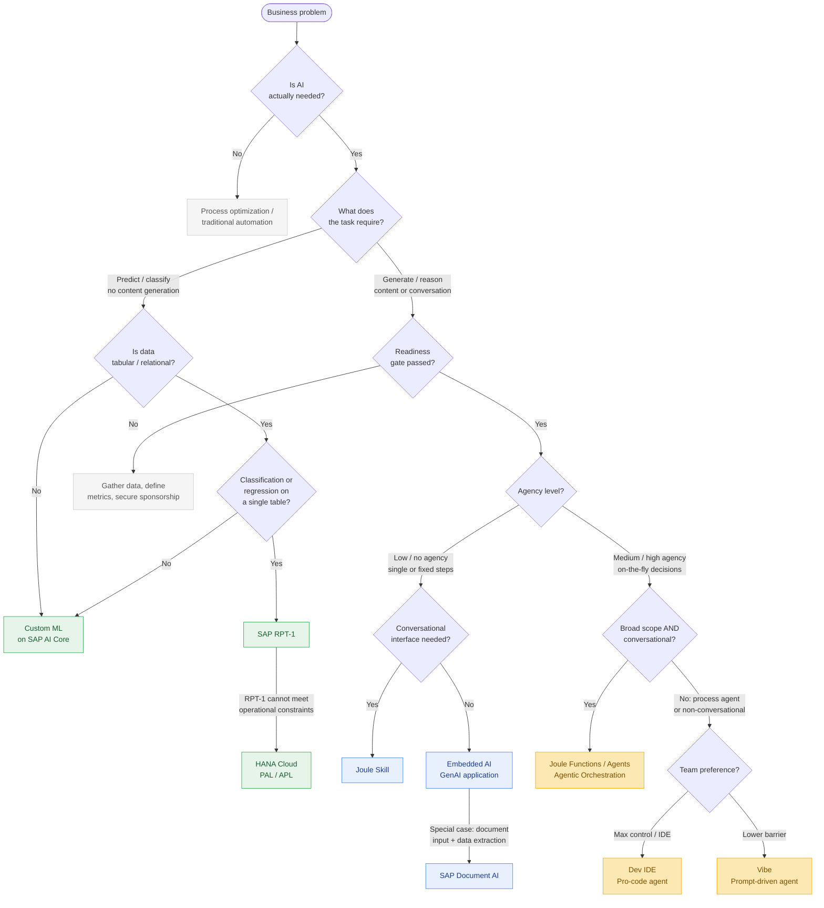

# SAP AI Pathfinder

[](https://opensource.org/licenses/Apache-2.0)
[](https://agentskills.io)
[](https://claude.ai/code)

> **Stop guessing which SAP AI technology to use.** This skill guides you from business problem to production-ready architecture — in one conversation.

SAP's AI portfolio is vast and fast-moving: RPT-1, Joule, Generative AI Hub, AI Agents, Document AI, HANA PAL/APL, Joule Studio, Agent Fabric... Choosing wrong costs months. This skill helps you choose right, first time.

Based on the official [SAP AI Golden Path](https://architecture.learning.sap.com/docs/ai-golden-path) — SAP's recommended decision framework for AI on BTP.

---

## What it does

You describe your use case. The skill walks you through a structured decision framework and tells you:

- **Whether AI is even the right approach** (or whether process optimization would do the job)
- **Which SAP AI technology fits** your specific combination of data, workflow, and agency needs
- **How to implement it** — architecture patterns, key services, gotchas, and links to official resources

### Example

> *"We want to automatically extract line items from incoming supplier invoices and post them to SAP."*

A common instinct is to reach for a generic LLM. The skill works through the framework and recommends **SAP Document AI as an Embedded AI implementation** — a purpose-built extraction service with pre-trained models for standard document types, managed pipelines, and a UI for human review. No LLM prompt engineering, no hallucination risk on financial data, no custom infrastructure.

---

## Quick start

### Claude Code

```bash
# Project-level (recommended)
mkdir -p .claude/skills
git clone https://github.com/jansellmann/sap-ai-pathfinder .claude/skills/sap-ai-pathfinder
# or just copy the folder

# Then invoke with:
/sap-ai-pathfinder
```

### Other Agent Skills-compatible tools

| Tool | Directory |
|---|---|
| Claude Code | `.claude/skills/sap-ai-pathfinder/` |
| OpenAI Codex | `.agents/skills/sap-ai-pathfinder/` |
| VS Code Copilot | `.agents/skills/sap-ai-pathfinder/` |
| Roo Code | `.roo/skills/sap-ai-pathfinder/` |

### Cursor / Windsurf

Paste the contents of `SKILL.md` into `.cursorrules` or `.windsurfrules`. Add `references/` files as additional context when needed.

### Any LLM or assistant (Claude.ai, ChatGPT, etc.)

Upload `SKILL.md` as a file or paste it as a system prompt. Upload the relevant `references/*.md` files for deeper questions on specific topics.

---

## Technologies covered

| Category | Technologies |
|---|---|
| Classic ML | SAP-RPT-1, HANA Cloud PAL/APL, Custom ML on AI Core |
| GenAI Applications | Generative AI Hub, Orchestration Service, SAP AI SDK, CAP LLM Plugin, RAG with HANA Vector Engine |
| Conversational AI | Joule Skills, Joule Studio |
| AI Agents | Agent Fabric, Dev IDE (Pro-code), Vibe (Prompt-driven), Joule Functions/Agents |
| Document Processing | SAP Document AI |
| Interoperability | A2A Protocol, MCP |

---

## Decision framework



---

## File structure

```
sap-ai-pathfinder/
├── SKILL.md                        # Decision framework + implementation pointers (start here)
└── references/
    ├── genai-applications.md       # GenAI app architecture, RAG, CAP, Orchestration Service
    ├── ai-agents.md                # Low-code and pro-code agents, A2A/MCP, Joule integration
    ├── joule-skills.md             # Joule Skill development, best practices, tutorials
    ├── classic-ml.md               # RPT-1, HANA PAL/APL, Custom ML on AI Core
    └── document-ai.md             # SAP Document AI, PaaS vs SaaS, API access
```

---

## Keeping it current

SAP's AI portfolio evolves quickly. Known roadmap items to verify before committing:

| Item | Status to check |
|---|---|
| RPT-1 explainability | Targeted H2 2026 — verify if released |
| Agent Gateway GA | Targeted Q4 2026 — verify current availability |
| RPT-1.5 | Targeted H2 2026 — verify if available |
| Model availability | Monitor [SAP Note 3437766](https://me.sap.com/notes/3437766) |

---

## Contributing

Found something outdated? Missing a technology? PRs welcome.

- **Gotchas and limitations** are especially valuable — if you hit a wall that isn't documented here, please add it
- **Keep references lean** — link to official SAP docs rather than duplicating them
- **One PR per topic** — easier to review and merge

---

## Disclaimer

This is an unofficial community resource, not an official SAP publication. For authoritative guidance, refer to the [SAP Help Portal](https://help.sap.com) and the [SAP Architecture Center](https://architecture.learning.sap.com).

---

## License

Apache-2.0 — see [LICENSE](LICENSE).

Based on [SAP Architecture Center](https://github.com/SAP/architecture-center), Copyright 2025 SAP SE or an SAP affiliate company and architecture-center contributors, licensed under Apache-2.0. Packaged for Agent Skills format by Jan Sellmann.
